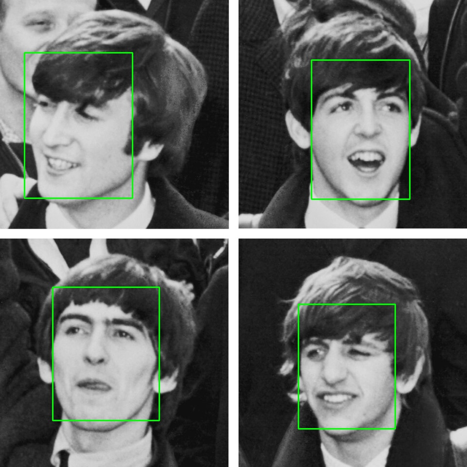

# Поиск лиц на фотографиях

**Аналитическая записка**

## 1. Задача

Нужно автоматически разделить набор фотографий на две группы: **с лицами** и **без лиц**. На фото с лицами каждое лицо надо обвести рамкой, а результат сохранить в отдельную папку.

Требования к решению:

- находить все лица на снимке, в том числе повёрнутые, а не только смотрящие прямо в камеру;
- не находить «лица» там, где людей нет (фрукты, животные, предметы);
- работать на обычном компьютере без видеокарты;
- использовать готовые инструменты без обучения собственной модели.



## 2. Исходные данные

Для проверки собран тестовый набор из 6 изображений в папке `faces/`:

| Файл          | Размер, px | Что на снимке                               | Лиц на самом деле |
|---------------|------------|---------------------------------------------|:-----------------:|
| `beatles.jpg` | 960×960    | Группа The Beatles, одна голова повёрнута вбок | 4                 |
| `messi.jpg`   | 548×342    | Портрет, лицо анфас                         | 1                 |
| `woman.jpg`   | 512×512    | Портрет, лицо анфас                         | 1                 |
| `fruits.jpg`  | 512×480    | Фрукты                                      | 0                 |
| `owl.png`     | 960×677    | Сова                                        | 0                 |
| `vase.png`    | 960×1280   | Ваза                                        | 0                 |

Фото без людей включены специально: на них проверяется, не путает ли детектор с лицом сову (у неё есть «глаза» и «клюв») или округлые фрукты.

## 3. Рассмотренные варианты

### 3.1. Каскад Хаара `haarcascade_frontalface_default`

Первой была опробована классическая модель, которая поставляется вместе с OpenCV (`cv2.CascadeClassifier`). Это метод Виолы–Джонса 2001 года.

**Как работает.** Модель не «понимает», что такое лицо. Она проверяет набор простых шаблонов из светлых и тёмных прямоугольников: например, область глаз обычно темнее щёк, а переносица светлее глаз. Если в каком-то окне картинки совпадает достаточно много таких шаблонов, окно считается лицом.

**Почему не подходит:**

1. **Обучена только на лицах анфас.** Это видно уже из названия: `frontalface`. Все её шаблоны рассчитаны на лицо, смотрящее прямо в камеру. Когда голова повёрнута, один глаз пропадает или сдвигается, тени ложатся иначе, и шаблоны перестают совпадать. На `beatles.jpg` модель нашла **3 лица из 4**: голову Джона Леннона, повёрнутую вбок, она пропустила.
2. **Обходной путь неудобен.** В OpenCV есть отдельный каскад для профиля (`haarcascade_profileface`), но тогда каждую картинку надо прогонять дважды, убирать дубли, когда обе модели нашли одно и то же лицо, а промежуточные повороты (не анфас и не строгий профиль) всё равно теряются.
3. **Нет оценки уверенности.** Модель возвращает только рамки, без числа «насколько я уверена». Поэтому настроить строгость можно только косвенно, через параметры `scaleFactor` и `minNeighbors`, подбирая их вручную под конкретные фото.
4. **Чувствительна к освещению.** Шаблоны основаны на перепадах яркости, поэтому тени, контровой свет и низкий контраст заметно ухудшают результат.

### 3.2. Нейросеть YuNet (выбранный вариант)

**YuNet** — небольшая свёрточная нейросеть для поиска лиц (около 75 тыс. параметров, файл модели весит 232 КБ). Она встроена в OpenCV как `cv2.FaceDetectorYN`, поэтому дополнительные библиотеки не нужны, достаточно скачать файл модели `face_detection_yunet_2023mar.onnx`.

**Почему подходит:**

1. **Находит повёрнутые лица.** Модель обучена на наборе WIDER FACE, где лица сняты под разными углами, частично закрыты, разного размера и при разном освещении. Нейросеть сама выучивает признаки лица, а не опирается на заранее заданные шаблоны, поэтому поворот головы для неё не критичен. На `beatles.jpg` найдены **все 4 лица**.
2. **Даёт оценку уверенности.** Для каждого лица модель возвращает число от 0 до 1. Это позволяет одним параметром `score_threshold` задать, насколько строго отбирать лица. Все найденные лица на тестовых фото получили уверенность 0,91–0,94 при пороге 0,8, то есть запас большой.
3. **Нет ложных срабатываний.** На `fruits.jpg`, `owl.png` и `vase.png` модель не нашла ни одного лица.
4. **Работает быстро на процессоре.** Модель специально сделана маленькой, видеокарта не нужна.

## 4. Сравнение на тестовом наборе

Обе модели запускались на одних и тех же фото. Для каскада Хаара использовались стандартные параметры `scaleFactor=1.1`, `minNeighbors=5`, для YuNet — параметры из `main.py`. Время — среднее по 5 запускам на процессоре (OpenCV 4.14, macOS).

| Файл          | Лиц на самом деле | Хаар: найдено | YuNet: найдено | Хаар, мс | YuNet, мс |
|---------------|:-----------------:|:-------------:|:--------------:|---------:|----------:|
| `beatles.jpg` | 4                 | **3**         | 4              | 64       | 17        |
| `messi.jpg`   | 1                 | 1             | 1              | 20       | 6         |
| `woman.jpg`   | 1                 | 1             | 1              | 15       | 6         |
| `fruits.jpg`  | 0                 | 0             | 0              | 14       | 5         |
| `owl.png`     | 0                 | 0             | 0              | 39       | 33        |
| `vase.png`    | 0                 | 0             | 0              | 53       | 25        |
| **Итого**     | **6 лиц**         | **5 из 6**    | **6 из 6**     | 205      | 92        |

## 5. Выводы

- Каскад Хаара `frontalface` справляется только с лицами, которые смотрят прямо в камеру. Для задачи, где на фото могут быть повёрнутые головы, он не подходит: одно из шести лиц пропущено.
- YuNet нашла все лица, не ошиблась на фото без людей и при этом работала в среднем вдвое быстрее.
- Поэтому в программе используется YuNet.

**Ограничения проверки.** Тестовый набор маленький (6 фото, 6 лиц), поэтому результаты показывают разницу между подходами, но не дают точной оценки качества. Для более надёжного вывода стоит проверить модель на фото с сильно наклонёнными головами, лицами в масках или очках, мелкими лицами в толпе и при плохом освещении.

## 6. Как работает программа

1. Программа берёт все файлы `.jpg`, `.jpeg` и `.png` из папки `faces/`.
2. Каждое изображение передаётся в нейросеть YuNet.
3. Если лица найдены, вокруг каждого рисуется зелёная рамка, а картинка сохраняется в `results/`.
4. В конце выводится список файлов: `+` лица есть, `-` лиц нет.

### Параметры модели

| Параметр          | Значение             | Что означает                                                                                                        |
|-------------------|----------------------|---------------------------------------------------------------------------------------------------------------------|
| `score_threshold` | `0.8`                | Минимальная уверенность модели (от 0 до 1), чтобы засчитать лицо                                                    |
| `nms_threshold`   | `0.3`                | Порог перекрытия рамок. Модель обводит одно лицо несколькими рамками, и из перекрывающихся остаётся самая уверенная |
| `top_k`           | `5000`               | Сколько самых уверенных кандидатов допускается до удаления дублей                                                   |
| `backend_id`      | `DNN_BACKEND_OPENCV` | Движок для запуска нейросети                                                                                        |
| `target_id`       | `DNN_TARGET_CPU`     | Устройство для вычислений                                                                                           |

## 7. Установка и запуск

Нужен Python 3

```bash
# создать и активировать виртуальное окружение
python3 -m venv .venv
source .venv/bin/activate        # Windows: .venv\Scripts\activate

# установить OpenCV
pip install opencv-python

# запустить (из корня проекта)
python main.py
```

Запускать нужно из корня проекта: пути к `faces/`, `models/` и `results/` в программе указаны относительно него.

### Пример вывода

```
+    messi.jpg
+    beatles.jpg
+    woman.jpg
-    fruits.jpg
-    owl.png
-    vase.png
```
